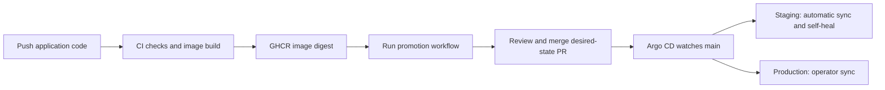

# GitOps deployment

This repository uses Argo CD with Kustomize for the existing `backend/` application.
The newer `apps/` microservices and frontend are outside this initial deployment scope.



## Files and behavior

- `gitops/base/backend.yaml`: backend Deployment and internal Service.
- `gitops/environments/staging/`: namespace `banking-staging`, one replica after promotion.
- `gitops/environments/production/`: namespace `banking-production`, two replicas after promotion.
- `gitops/argocd/`: restricted AppProject and two Applications watching `main`.
- `scripts/promote-gitops.py`: updates a single environment using an image digest.
- `.github/workflows/gitops.yml`: renders manifests and uploads them for review.

Both environments initially have **zero replicas** and an all-zero placeholder digest.
They will not run application containers until a real image is promoted. This is a
bootstrap state, not a published image or a working deployment.

Staging automatically reconciles merged Git changes, repairs drift, and prunes removed
resources. Production requires an operator to sync after reviewing the merged change.
Production drift is visible but is not automatically repaired. Applications have no
cascade-deletion finalizer, so deleting an Application does not delete its workloads.

## Bootstrap prerequisites

1. Push these files to this repository's `main` branch.
2. Install Argo CD in the target cluster's `argocd` namespace using a reviewed release
   from the official Argo CD installation instructions. This repository does not install
   the controller. Register repository credentials with Argo CD if the repository is private.
3. Provide MongoDB for each environment. The GitOps base does not deploy a database.
4. Create namespaces and the `banking-backend-secrets` Secret in each namespace.
   The Secret must contain `MONGO_URI` and `JWT_SECRET`; keep real values out of Git.
   Use your secret manager or an untracked, access-restricted env file:

   ```powershell
   kubectl create namespace banking-staging
   kubectl create namespace banking-production
   kubectl -n banking-staging create secret generic banking-backend-secrets --from-env-file=<staging-secret-file>
   kubectl -n banking-production create secret generic banking-backend-secrets --from-env-file=<production-secret-file>
   ```

5. For private GHCR images, configure registry credentials through an imagePullSecret on
   each namespace's default ServiceAccount before promotion.
6. Apply the Argo CD definitions using the intended cluster context:

   ```powershell
   kubectl apply -k gitops/argocd
   kubectl -n argocd get applications
   ```

The readiness probe checks that the HTTP port is accepting connections. It does not
prove database readiness or business-operation health.

## Publish and promote

CI publishes `ghcr.io/kmdsuhail72/banking-backend` on pushes to `main` and version tags.
Use the published `sha256:...` digest from the build output or GHCR package metadata.
Tags can be moved; these manifests deploy digests to identify exact image content.

In GitHub, enable **Settings > Actions > General > Workflow permissions > Allow GitHub
Actions to create and approve pull requests**. Configure `staging` and `production`
GitHub Environments and their review rules. The workflow opens a PR; it does not approve it.

Run **Actions > Banking platform CI/CD > Run workflow**, choose the environment and
supply `image_digest`. The workflow verifies that the image exists, renders the proposed environment and Argo CD manifests, uploads them as a review artifact, and opens or updates
`gitops/promote-<environment>` against `main`. Review and merge the PR. No kubeconfig is
needed in GitHub Actions.

PRs created with `GITHUB_TOKEN` may not trigger other Actions workflows. Run **Validate
GitOps manifests** manually on the promotion branch before merging if automatic PR checks
are absent. If branch protection requires PR-triggered checks, use an approved GitHub App
installation token for PR creation or open the promotion PR yourself with the CLI below.

To prepare a promotion locally:

```powershell
python scripts/promote-gitops.py staging sha256:<published-64-character-digest>
kubectl kustomize gitops/environments/staging
```

Commit the changed environment file on a branch and open a PR. The script validates digest
syntax; only the workflow also checks registry availability. Promote the same tested digest
to production, merge, then select **Sync** for `banking-production` in Argo CD (or run
`argocd app sync banking-production`). GitHub Environment approval controls PR creation;
Argo CD RBAC controls who may sync production.

## Show the deployment

Render desired state locally without deploying:

```powershell
kubectl kustomize gitops/environments/staging
kubectl kustomize gitops/environments/production
kubectl kustomize gitops/argocd
```

After bootstrap and promotion, inspect actual state:

```powershell
kubectl -n argocd get applications
kubectl -n banking-staging rollout status deployment/banking-backend --timeout=5m
kubectl -n banking-staging get pods,svc
kubectl -n banking-staging port-forward svc/backend-service 5000:5000
```

The forwarded backend is available at `http://localhost:5000`. To open the Argo CD UI,
run `kubectl -n argocd port-forward svc/argocd-server 8080:443`, then visit
`https://localhost:8080` and sign in with your configured Argo CD account.

## Rollback and ownership

Revert the environment promotion commit through a PR to restore the previous digest.
Staging reconciles the revert automatically; production requires another sync. Reverting
the first promotion restores the zero-replica bootstrap state. Database migrations/data
are not rolled back by an image revert.

Avoid applying `k8s/` or the Helm chart into the GitOps namespaces: those older local-demo
manifests are separate deployment options. Do not use `kubectl set image` for releases in
Argo-managed environments; commit the desired image to Git instead. Existing deployments
in other namespaces are not migrated by this setup.

## References

- Argo CD Application specification: https://argo-cd.readthedocs.io/en/latest/user-guide/application-specification/
- Kubernetes Kustomize documentation: https://kubernetes.io/docs/tasks/manage-kubernetes-objects/kustomization/
